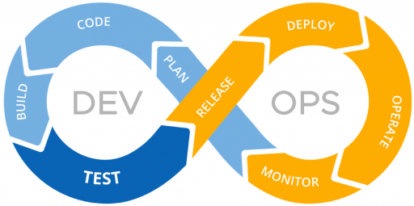
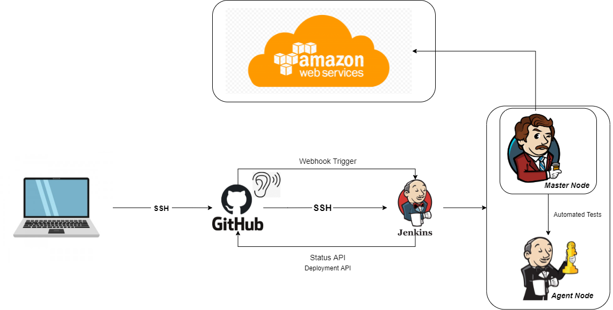

# DevOps and CICD

## DevOps
- Combine Dev and Ops teams
- Set of practices to build, test, and release software faster

## SDLC
- Plan/Design
- Develop
- Test
- Deploy

### Problems with traditional SDLC
- Scale and complexity
- Manual and slow
- Broken communication
- Human errors
- Large volume of testing
- Long deployment window
- High cost

### DevOps SDLC
- DevOps aims to improve SDLC - Agile
- DevOps Lifecycle



- Stages
  - Continuous Development
  - Continuous Testing
  - Continuous Integration
  - Continuous Delivery/Deployment
  - Continuous Monitoring

## CI/CD
- Continuous Integration
  - Integrating all the developers working copies into a shared mainline serveral times a day
- Continous Delivery
  - Teams produce softwawre in short cycles
  - Ensure that software can be manually deployed at any time
- Continous Deployment
  - The deployment is automated

## Jenkins
- Open-source automation server used to bulid CICD pipeline

## Webhook Trigger
- Listens for pushes and commits to github from localhost

## aaa
- Commands
```
cd app
npm install
npm test
npm start
```
- Test12


# Let's build a Continuous Integration and Continuous Delivery/Deployment (CICD) Pipeline
## Jenkins
### Webhooks with Git-hub
[Steps on how to integrate github](https://www.blazemeter.com/blog/how-to-integrate-your-github-repository-to-your-jenkins-project/)
- Github settings
  - Go to settings of repo and select webhooks
  - enter jenkins url with "/github-webhook/" at the end
- Jenkins settings
  - New job
  - https github url in the "project url"
  - check "Git" in the source code management
    - ssh github url in "Repository url"
    - add ssh key for credentials
  - check "provide Node and npm in "Build Environment"
  - add execute shell build step
    ```
    cd app
    npm install
    npm test
    ```
#### Automated Testing using Jenkins (CI job)
- Add description
- Discard old build - keep max number of 3 builds
- Check GitHub project and add https link
- Source code management
  - add github ssh link
  - add github ssh private key for that repository
  - Branches to build - add "*/master"
- Build triggers
  - check GitHub hook trigger for GITScm polling box
- Build Environment
  - check the provide Node & npm box
  - keep settings as default
- Build
  - choose execute shell
  ```
  cd app
  npm install
  npm test
  ```
- Post-build actions
  - add merge job to build other pojects when complete

### Merge job using Jenkins
- Add description
- Discard old builds after 3 max builds
- add https link for github project
- Source code management
  - add github ssh link
  - use github ssh private key for that repository
  - add "*/dev" to the branches to build
  - For additional behaviours choose merge before build
    - name of repository - origin
    - branch to merge to - master or main
    - The rest default 
- Post bulid actions
  - Choose git publisher
  - check merge results
  - for Branches
    - Branch to push - master or main
    - Target remote name - origin
#### Automated Deployment on AWS EC2 for 2Tier architecture - Nodejs app and Mongodb  
- AWS Steps
  - Launch ec2 instance 18.04 LTS
  - SG to allow port 22 from your IP, port 3000 and http 80
- Jenkins Steps
  - Add description
  - discard old builds after 3
  - add github https
  - Source code management same as before
  - Build environment
    - add ssh agent for aws (the private key used to ssh into ec2)
  - Build - execute shell
    - To ssh from jenkins
      ```
      ssh -A -o "StrictHostKeyChecking=no" ubuntu@ec2IP << EOF
      ```
    - The commands to run app
- Jenkins Workflow test
  


  ##### Contiounus Integration Continuous Delivery/Deployment 


###### Let's break it down 
  

### For deployment job in Jenkins
- In the execute shell of CD job

```
# we need to by pass the key asking stage with below command:
ssh -A -o "StrictHostKeyChecking=no" ubuntu@ec2-ip << EOF	
# copy the the code
# run your provision.sh to install node with required dependencies for app instance - same goes for db instance (ensure to double check if node and db are actively running)

# create an env to connect to db
# navigate to app folder
# kill any existing pm2 process just in case
# launch the app
nohup node app.js > /dev/null 2>&1 & - use this command to run node app in the background

# To debug ssh into your ec2 and run the above commands
    

EOF
```
## Jenkins CI Lab - Solution

##### Steps

##### Source Code Management

1. Set Branches to Build to develop
2. Under additional behaviours click add and "Merge before build"
3. name of repo "origin"
4. branch to merge "main"

### Post-Build Actions

#### Git Publisher

1. Add Post Build Action
2. Git Publisher
3. Push Only if Build Succeeds
4. Merge Results

--- 
Tigger deployment job if the merge was successfull


